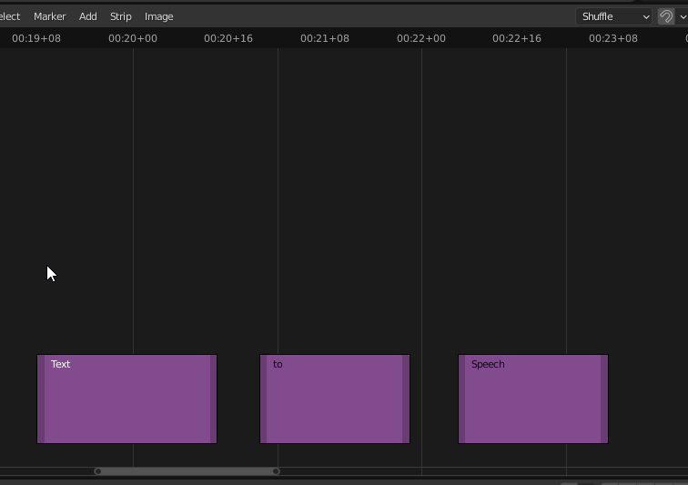

# Text Strip to Speech
Convert Blender Video Sequence Editor text strips to sound strips with speech.

## Installation
Right-click on the Blender icon and select "Run as Administrator", or else will the gtts module not be installed properly on Windows.

## Usage
Select one or more text strips. 
Use Menu > Strip > Convert to Speech/Speaker to execute the operator.

## Disclaimer
This is a stripped down version of Mark Lagana's Text to Speech add-on. This version is only for converting text strips to speech.
